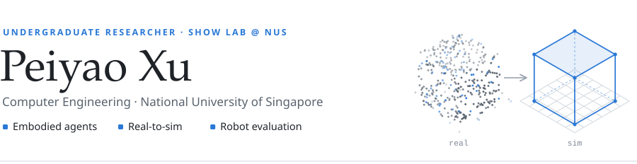
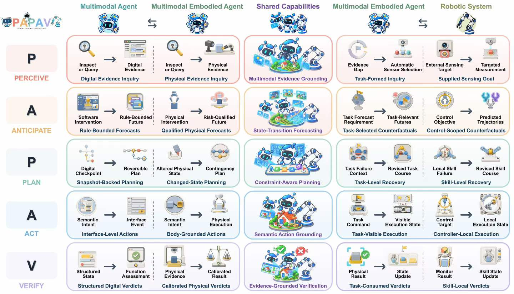
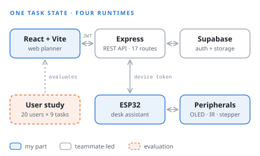
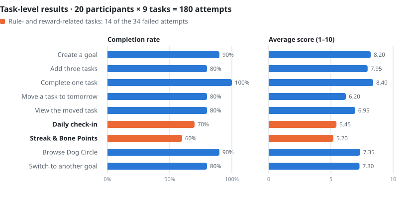

<picture>
  <source media="(prefers-color-scheme: dark)" srcset="assets/header-dark.svg">
  
</picture>

<p>
    <a href="mailto:xupeiyao@u.nus.edu" title="xupeiyao@u.nus.edu">Email</a> &nbsp;·&nbsp;
  <a href="https://orcid.org/0009-0001-6040-0562">ORCID</a> &nbsp;·&nbsp;
  <a href="https://www.linkedin.com/in/peiyao-xu-26b790352">LinkedIn</a>
  <!-- Add once they exist:
  &nbsp;·&nbsp; <a href="https://scholar.google.com/citations?user=XXXXXXX">Google Scholar</a>
  &nbsp;·&nbsp; <a href="https://USERNAME.github.io">Homepage</a>
  -->
</p>

I'm a second-year Computer Engineering student at the **National University of Singapore** (Minor in Mathematics, Science & Technology Undergraduate Scholar) and an undergraduate researcher at **[Show Lab](https://sites.google.com/view/showlab)**, led by Prof. Mike Zheng Shou.

I'm interested in **embodied agents**, systems that perceive, plan and act in the physical world, and in how we train and evaluate them. 

Before research, most of what I built sat between software and hardware: ESP32 and ATmega328P firmware, sensor-driven rescue robots, and a web app that stays in sync with a desk device.

## News

- **2026.09** &nbsp; Our survey on multimodal embodied agents, which introduces the **PAPAV** capability framework, is out as a preprint. [[paper]](https://doi.org/10.6084/m9.figshare.33529048)
- **2026.07** &nbsp; Joined **Show Lab @ NUS** as an undergraduate researcher.
- **2026.07** &nbsp; Finished **ShibaSteps** (NUS Orbital) and evaluated it in a 20-participant user study.
- **2026.03** &nbsp; Our autonomous rescue robot team finished **2nd**.
- **2025.08** &nbsp; Started my B.Eng. in Computer Engineering at NUS.

## Publications

<p align="center">
  
</p>

<a href="https://doi.org/10.6084/m9.figshare.33529048"><b>Survey on Multimodal Embodied Agents: A Unified Capability-centric Perspective from Computer-Use to Robot-Use</b></a>
<br>
<sub>Yanzhe Chen, Ziyi Yang, Jifeng Zhu, Qiming Huang, Ruihe An, <b>Peiyao Xu</b>, Hesen Yang, Runda Liu, Chang Gong, Zhijun Cao, Zechen Bai, Wenzheng Zeng, Yiqi Lin, Guoqiang Liang, Kevin Yuchen Ma, Qinghong Lin, Mike Zheng Shou</sub>
<br>
<i>Preprint</i>, 2026 &nbsp;·&nbsp; <a href="https://doi.org/10.6084/m9.figshare.33529048">[Paper]</a>

What changes when a multimodal agent moves from computer-use to robot-use? We describe embodied agents by five recurring capabilities: **P**erceive, **A**nticipate, **P**lan, **A**ct and **V**erify. Across 64 benchmarks, evaluation centres on Act; only 5 assess Anticipate and 3 assess Verify.
<td valign="top">
<a href="https://doi.org/10.6084/m9.figshare.33529048"><b>Survey on Multimodal Embodied Agents: A Unified Capability-centric Perspective from Computer-Use to Robot-Use</b></a>
<br>
<sub>Yanzhe Chen, Ziyi Yang, Jifeng Zhu, Qiming Huang, Ruihe An, <b>Peiyao Xu</b>, Hesen Yang, Runda Liu, Chang Gong, Zhijun Cao, Zechen Bai, Wenzheng Zeng, Yiqi Lin, Guoqiang Liang, Kevin Yuchen Ma, Qinghong Lin, Mike Zheng Shou</sub>
<br>
<i>Preprint</i>, 2026
<br><br>
What changes when a multimodal agent moves from computer-use to robot-use? We describe embodied agents by five recurring capabilities: <b>P</b>erceive, <b>A</b>nticipate, <b>P</b>lan, <b>A</b>ct and <b>V</b>erify. Across 64 benchmarks, evaluation centres on Act; only 5 assess Anticipate and 3 assess Verify.
<br><br>
<a href="https://doi.org/10.6084/m9.figshare.33529048">[Paper]</a>
<!-- &nbsp;<a href="https://arxiv.org/abs/XXXX.XXXXX">[arXiv]</a> -->
<!-- &nbsp;<a href="https://github.com/USERNAME/Awesome-Embodied-Agent-Benchmarks">[Benchmark list]</a> -->
</td>
</tr>
</table>

<details>
<summary><b>BibTeX</b></summary>

```bibtex
@misc{chen2026survey,
  title     = {Survey on Multimodal Embodied Agents: A Unified Capability-centric
               Perspective from Computer-Use to Robot-Use},
  author    = {Chen, Yanzhe and Yang, Ziyi and Zhu, Jifeng and Huang, Qiming and
               An, Ruihe and Xu, Peiyao and Yang, Hesen and Liu, Runda and
               Gong, Chang and Cao, Zhijun and Bai, Zechen and Zeng, Wenzheng and
               Lin, Yiqi and Liang, Guoqiang and Ma, Kevin Yuchen and
               Lin, Qinghong and Shou, Mike Zheng},
  year      = {2026},
  publisher = {figshare},
  note      = {Preprint},
  doi       = {10.6084/m9.figshare.33529048}
}
```

</details>

## Selected Projects

## Selected Projects

<table>
<tr>
<td width="44%" valign="top">
<picture>
  <source media="(prefers-color-scheme: dark)" srcset="assets/shibasteps-dark.svg">
  
</picture>
</td>
<td valign="top">
<a href="https://github.com/yyy3254422785-dev/mimimi-map"><b>ShibaSteps: Turning Long-term Goals into Daily Actions, on Screen and on the Desk</b></a>
<br>
<sub>NUS Orbital 2026 · with Yu Jinlin · my part: frontend &amp; UI, ESP32 firmware &amp; hardware</sub>
<br><br>
Turns long-term goals into dated tasks and puts the current one on an ESP32 desk assistant with a focus timer and a physical completion button.
<br><br>
<b>System</b> · Four runtimes share one task/timer state over 17 REST routes; the device completes tasks optimistically and retries sync.
<br><br>
<b>User study</b> · 20 participants × 9 tasks: <b>81.1%</b> of 180 attempts succeeded. Completing a task scored best (100%, 8.4/10), while check-in and reward rules accounted for 14 of the 34 failures: the gap was explaining rules, not the core interaction.
<br><br>
<a href="https://github.com/yyy3254422785-dev/mimimi-map">[Code]</a>
&nbsp;<a href="https://github.com/xupeiyao-dev/xupeiyao-dev/blob/main/assets/ShibaSteps-report.pdf">[Report]</a>
</td>
</tr>
</table>

<details>

<details>
<summary><b>ShibaSteps user-study results by task</b></summary>
<br>
<picture>
  <source media="(prefers-color-scheme: dark)" srcset="assets/shibasteps-study-dark.svg">
  
</picture>

**Caveats.** One testing round with self-reported scores; the nine tasks cover the web app only, so the desk device still needs its own usability study.

</details>

**More projects**

- **Lunar Rescue Robot** · <sub>team project · 2026</sub><br>
  Bare-metal ATmega328P firmware for motor control and sensing (GPIO, PWM, ADC, interrupts, timers, UART), connected to Raspberry Pi remote commands and LiDAR mapping to navigate a simulated lunar rescue course.
- **Autonomous Rescue Robot** · <sub>team project · 2026 · 2nd place</sub><br>
  Sensor-driven navigation on a 4-motor platform with ultrasonic, infrared and colour sensors, debugged through iterative bench and course testing.
<!-- Course projects: link a demo video or write-up here instead of the source code if the course does not allow publishing code. -->

---

<sub><b>Toolbox</b> &nbsp; Python · C/C++ · JavaScript &nbsp;|&nbsp; React · Node/Express · REST &nbsp;|&nbsp; ESP32 · ATmega328P · Raspberry Pi · LiDAR · I²C / UART / PWM</sub>
<br>
<sub>Last updated: September 2026</sub>
